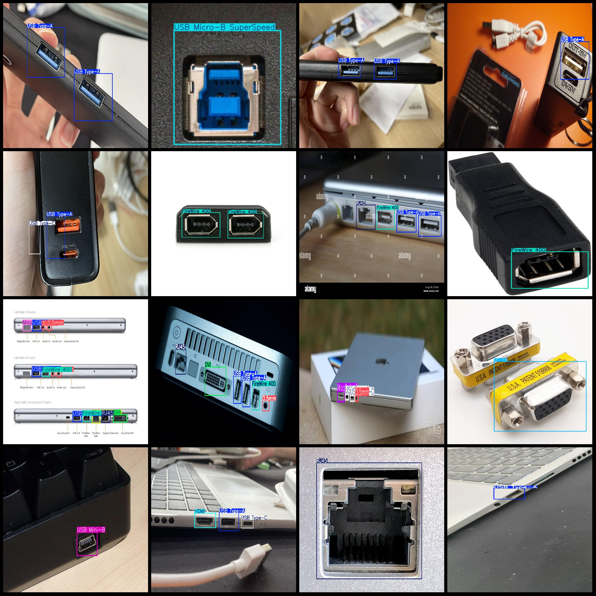
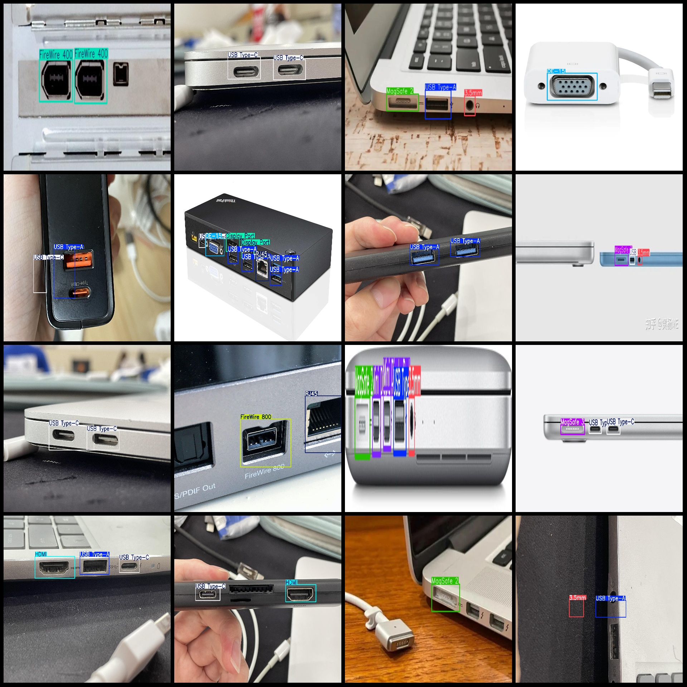

# USB Interface Type C, HDMI, etc. Common Interfaces Detection Dataset (VOC+YOLO format, 222 images, 18 categories)

Dataset format: Pascal VOC format + YOLO format (txt file without segmentation paths, only contain jpg images and corresponding VOC format xml files and yolo format txt files)

Number of images (jpg files): 222
Number of annotations (xml files): 222
Number of annotations (txt files): 222
Number of annotation categories: 18
Annotation category names: ["3.5mm", "DE-15", "DVI", "Display Port", "FireWire 400", "FireWire 800", "HDMI", "MagSafe 1", "MagSafe 2", "MagSafe 3", "Mini DisplayPort"]
"RJ45", "USB Micro-B", "USB Micro-B SuperSpeed", "USB Mini-B", "USB Type-A", "USB Type-B SuperSpeed", "USB Type-C"]

Number of boxes in each category
- 3.5mm frame count: 72
- DE-15 box count: 25
- DVI box count: 13
- Display Port box count: 15
- FireWire 400 box count: 38
- FireWire 800 box count: 25
- HDMI box count: 52
- MagSafe 1 box count: 14
- MagSafe 2 Frame Count: 19
- MagSafe 3 box count: 24
- Mini DisplayPort box count: 22
- RJ45 box count: 37
- USB Micro-B box count: 10
- USB Micro-B SuperSpeed box count: 9
- USB Mini-B box count: 7
- USB Type-A Frame Count: 126
- USB Type-B SuperSpeed box count: 9
- USB Type-C box count: 145

Total Frames: 662

Image resolution: Multi-resolution images, such as 590x460, 445x259, etc.

Use the annotation tool: labelImg

Markup Rules: Draw a box around the category

Important Note: The dataset has not been split into training, validation, and test sets, so you need to manually split it.

Special Notice: This dataset does not guarantee the accuracy of the model or weight files trained.

Preview:
## Image

Here is a pay link on Stripe ( https://buy.stripe.com/3cs8yP7sY87d0vu9AB ). Please contact me lonlonago@foxmail.com after funding $89, and I will send you a complete data files , thank you!

